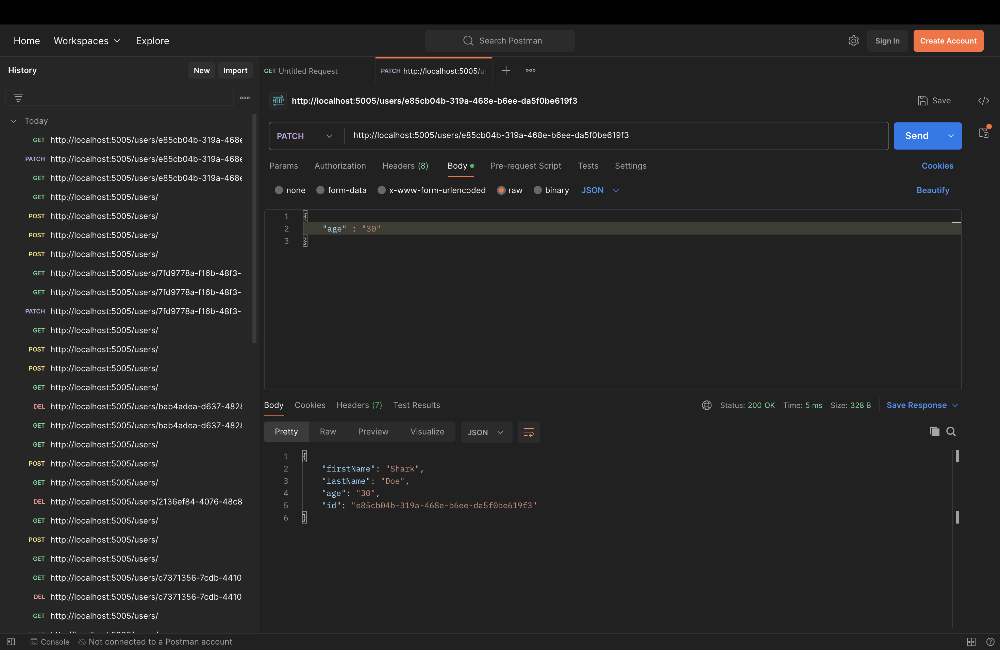

# RestAPI with Node.JS, and Express

## Dependencies

- nodmon: Added for runnig server all the time and gets updates automatically. So before adding this dependency each time we needed to stop and start the application(using command `node index.js`), but after adding this dependency we can make updates runtime and nodeman will resrt the app again. We also added `"start": "nodemon index.js"` to the package.json

## Package.json

- Added `"type": "module"` a type field allows a package to specify all .js files within are ES(Ecma Script) modules, otherwise common .js files

- Postman
  Use of Postman for making requests to get, add, update and delete user. We can make request to view users data only i.e. http://localhost:5005/users/ through this address.
  -- patch request: 
